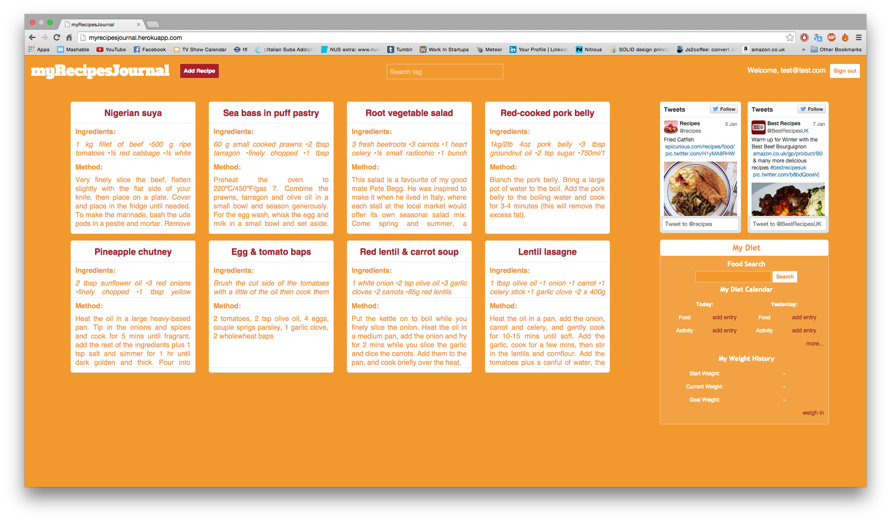
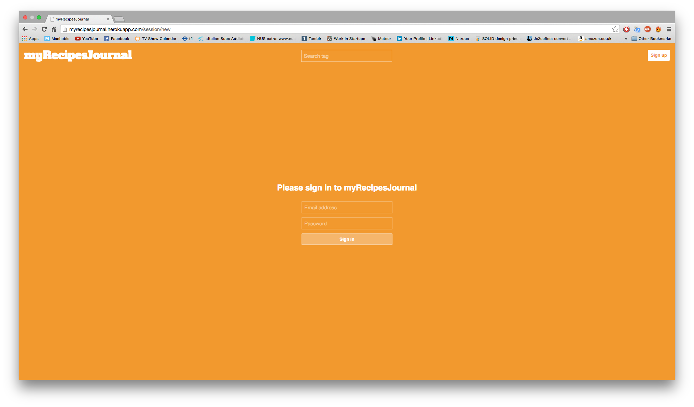
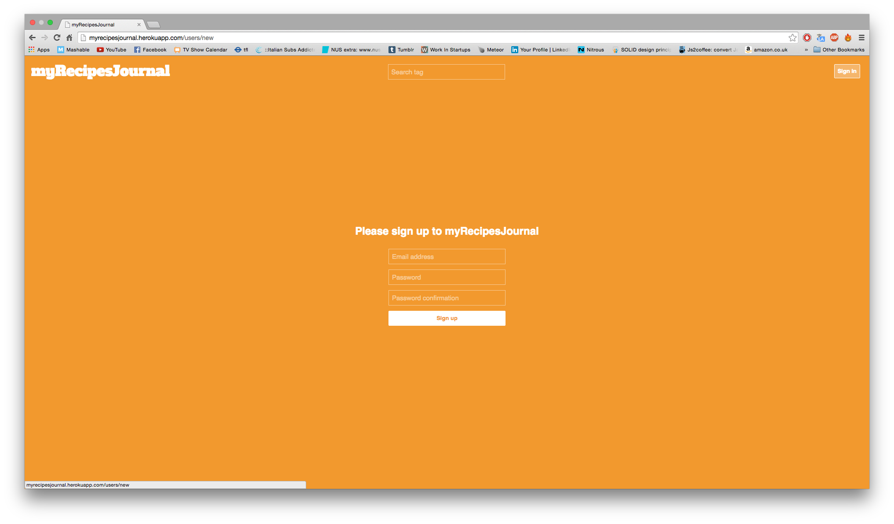
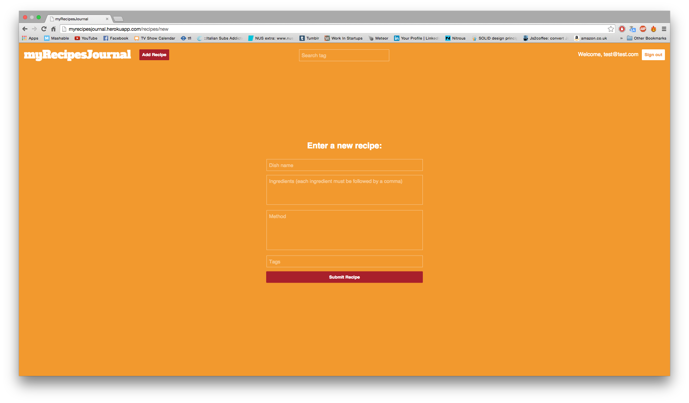

[](https://codeclimate.com/github/elenagarrone/bookmark_manager)
[](https://codeclimate.com/github/elenagarrone/bookmark_manager)

myRecipesJournal
================

During week four we built a bookmark manager, similar to pineapple.io or delicious.com in spirit. A bookmark manager is a good use case for exploring how relational databases work.





Technologies:
------------
- Ruby
- Rspec
- Capybara
- Sinatra
- PostgreSQL
- BCrypt
- DataMapper
- HTML/CSS
- JQuery

On Heroku:
---------
http://myrecipesjournal.herokuapp.com

To do:
-----
- [ ] main page for the single recipe;
- [ ] edit and delete button;
- [ ] remove glow from some of the buttons;
- [ ] profile page for the user;

How to use:
----------
Clone the repo:
```shell
$ git clone https://github.com/elenagarrone/myRecipesJournal
```
Change into the directory:
```shell
$ cd myRecipesJournal
```
Supposing you have installed <a href='http://www.postgresql.org/'>PostgreSQL</a>, create the databases:
```shell
$ psql
> create database "myrecipesjournal_development";
#and
> create database "myrecipesjournal_test";
#after they have been created, type:
>\q
```
Install the gems:
```shell
$ bundle install
```
Try it on localhost:
```shell
$ rackup
#then on the browser go to:
localhost:9292
```

How to test it:
--------------
From inside the directory run:
```shell
$ rspec
```